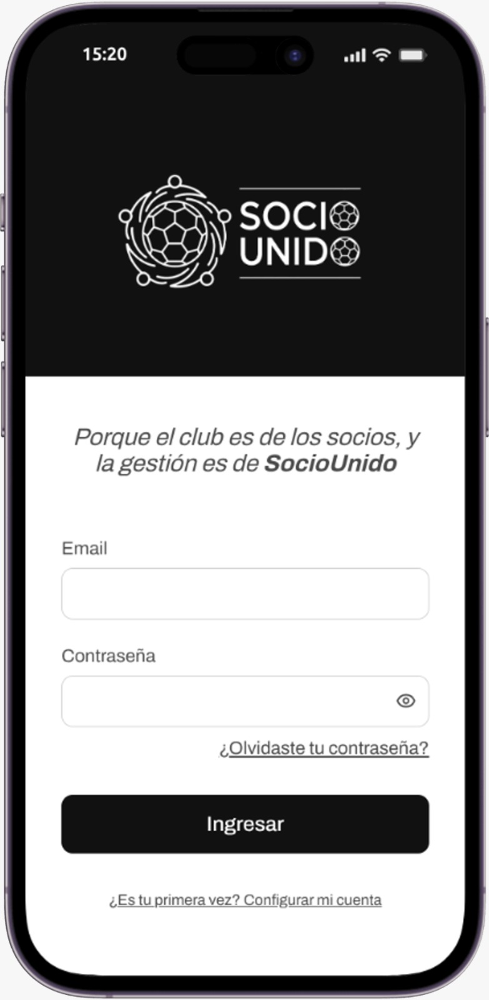
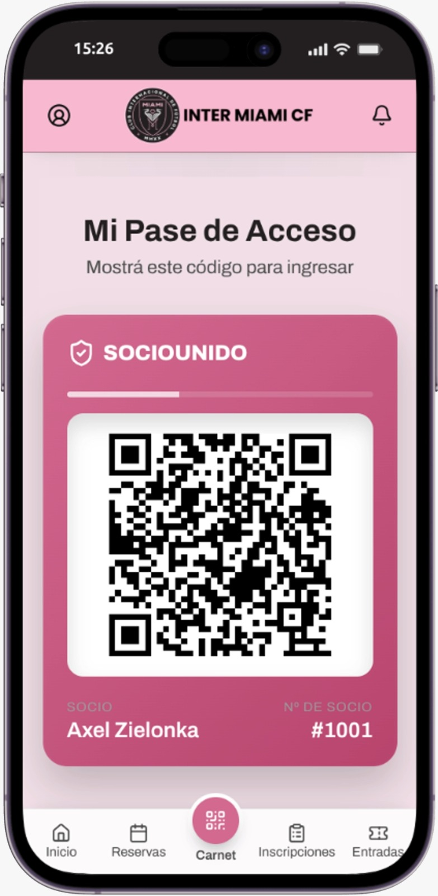
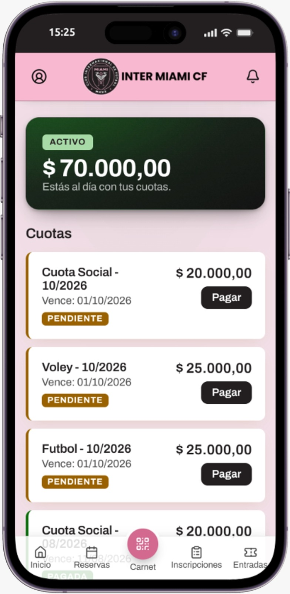

# 📱 Interfaces de la aplicación

Aquí se documentan las pantallas principales de la Progressive Web App (PWA) de SocioUnido. 

Para demostrar la flexibilidad de la plataforma y su capacidad de personalización (marca blanca), se exponen dos variantes para cada vista: el **Esquema neutro** (base por defecto de SocioUnido) y el **Esquema personalizado**, aplicado a modo de ejemplo utilizando la identidad institucional del **Inter Miami CF** de Estados Unidos.

## Login

La puerta de entrada a la plataforma, donde el socio ingresa sus credenciales o recupera su contraseña.

  

    <h4>SocioUnido Neutro</h4>
    
  

  

    <h4>Inter Miami CF</h4>
    
  

## Home

El panel principal de bienvenida, que consolida el estado del socio, los accesos rápidos a sus gestiones más frecuentes y las noticias destacadas del club.

  

    <h4>SocioUnido Neutro</h4>
    
  

  

    <h4>Inter Miami CF</h4>
    
  

## Carnet

La credencial digital y código QR dinámico que permite al socio identificarse e ingresar a las instalaciones o eventos deportivos.

  

    <h4>SocioUnido Neutro</h4>
    
  

  

    <h4>Inter Miami CF</h4>
    
  

## Cuotas y pagos

Módulo financiero donde el usuario puede revisar su historial de pagos, consultar deuda pendiente y abonar a través de las pasarelas integradas (ej. Mercado Pago).

  

    <h4>SocioUnido Neutro</h4>
    
  

  

    <h4>Inter Miami CF</h4>
    
  

